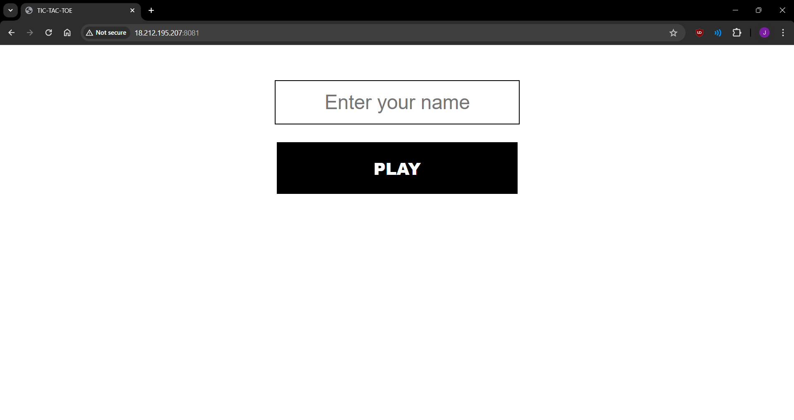
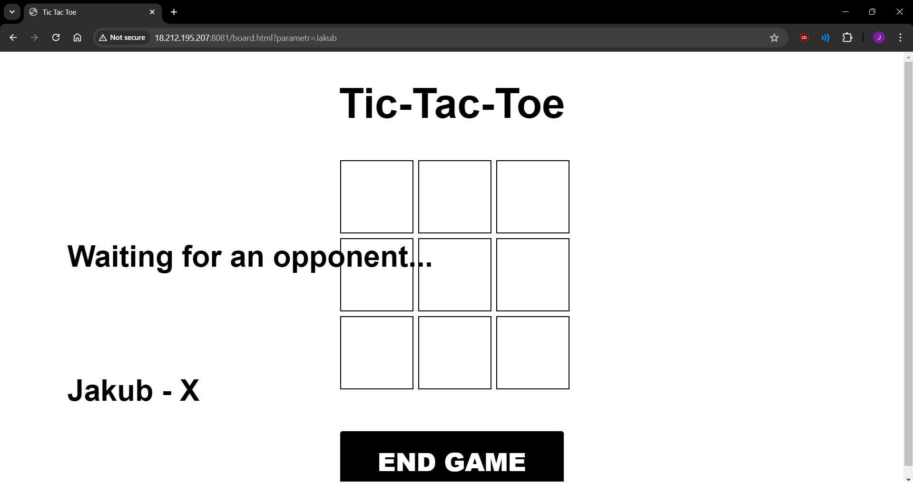
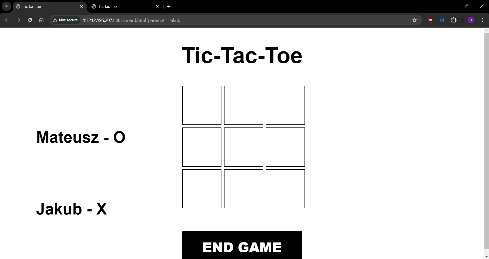
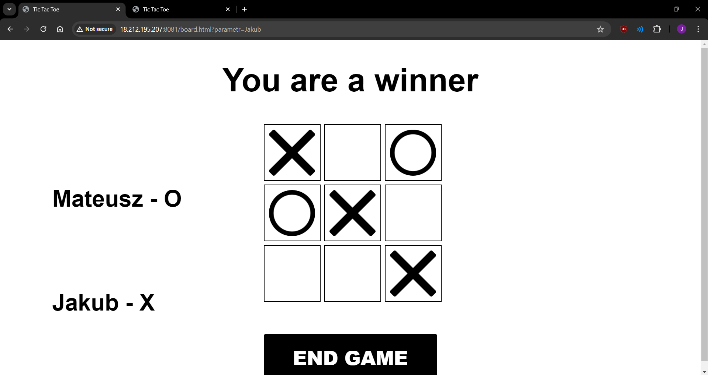
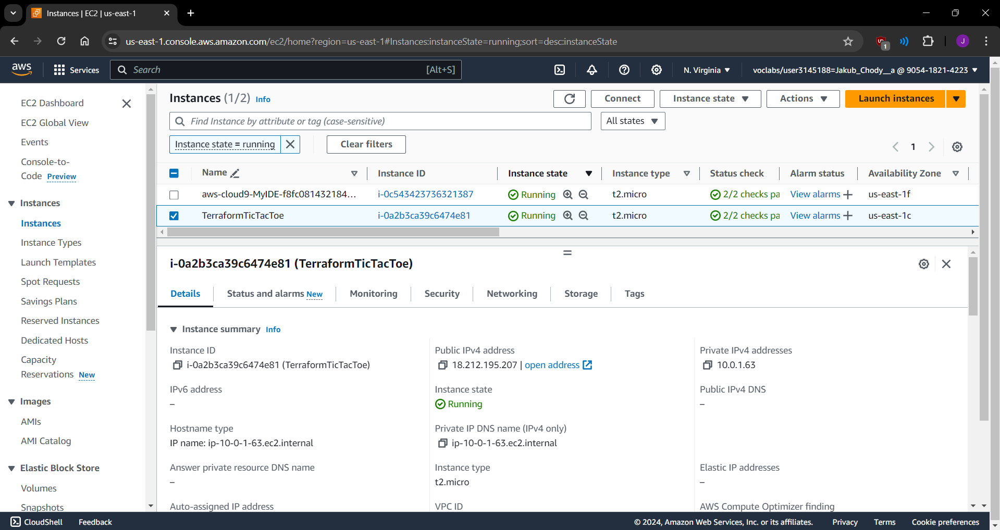

# Jakub Chodyła - Terraform, EC2, TicTacToe report

- Course: *Cloud programming*
- Group: *W04IST-SI4527G, Tuesday 11:15-13:00*
- Date: *30.04.2024*

## Environment architecture

Frontend - configured on port 8081, developed with `html/css/js`
Backend - configured on port 8080, developed with `python` using `flask`

Application can be run using Docker by command `docker-compose up -d`

## Preview

Screenshots of running application and configured AWS services.

## Reflections

- What did you learn?
*I learned how to deploy AWS EC2 instance with my application using Terraform*
- What obstacles did you overcome?
*I did overcome problems with accessing my github repository using ssh by changes in main.tf file and setting my repository as public. I also overcome problem with obtaining the IP of my instance and passing it to the frontend by changes in main.tf file.* 
- What did you help most in overcoming obstacles?
*Stackoverflow, YouTube tutorials and Mr. Thomas*
- Was that something that surprised you?
*How quickly my AWS account budget is getting used up*
